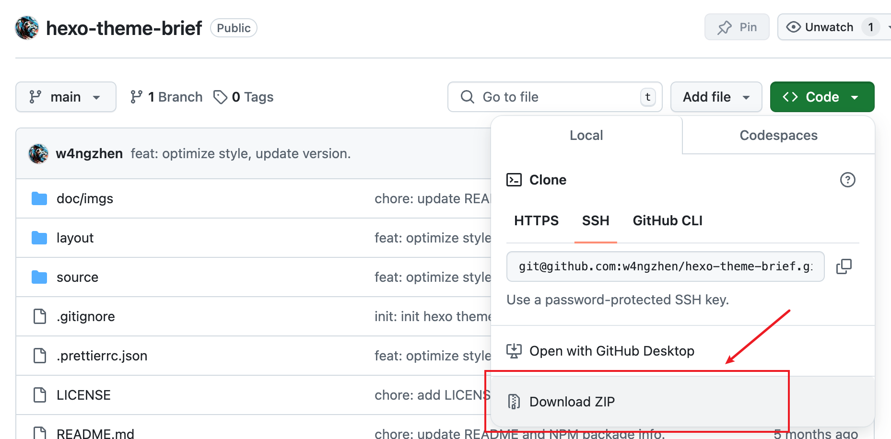
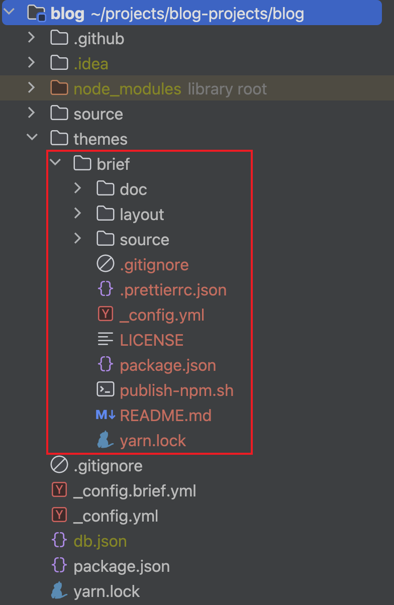

# hexo-theme-brief

一款适用于 Hexo v7.3+ 版本的简洁主题。你可以在这里预览：[https://brief-theme-example.project.zhen.wang](https://brief-theme-example.project.zhen.wang)（对应项目仓库：[https://github.com/w4ngzhen/brief-theme-example](https://github.com/w4ngzhen/brief-theme-example)）

## 起源

这款主题纯粹是为了我的个人博客而编写的：[https://zhen.wang](https://zhen.wang)。为了简洁，我抛弃了很多的模块（~~懒~~
），因此本主题现在不会有，将来也不会有：

- ~~评论模块~~
- ~~文章首页分页~~
- ~~各种网站埋点统计模块~~
- ~~炫酷的效果~~

当然，本主题代码不多，自认为逻辑比较清晰，所以自定义修改成本应该不太高。因此，如果有小伙伴**认可**本主题，同时又希望有一些定制的模块，
**强烈**推荐直接fork本项目去修改，**甚至是完全硬克隆一份改成自己的都可以**（不用说明来自本项目～）。

## 使用方式

### 配置修改

1. 创建Hexo项目
2. 进入Hexo项目根目录，打开根目录下`_config.yml`文件，将`_config.yml`中关于`theme: xxx`的配置改为`theme: brief`

> 上述步骤确保你的hexo项目确认启用hexo-theme-**brief**主题

### 安装主题

接下来进行`hexo-theme-brief`主题的正式安装。Hexo使用具体主题主要有两种方式：

- 手工方式：主题文件放置到`Hexo项目目录/themes/`目录下主题目录中
- npm方式：Hexo项目通过包管理器（npm、yarn、pnpm等）安装主题npm包

#### 手工方式

1）在`Hexo项目目录`下的`themes`目录中（没有则手动创建），创建一个名称对应于`_config.yml`中`theme`字段的主题名的空目录。在这里我们创建名为
`brief`的目录：

```
Hexo项目目录/
  - themes/
    - brief/ <--- 主题包目录
```

2）下载主题包文件：



3）解压主题包，将其中的相关内容（例如`layout`、`source`等目录）拷贝至`Hexo项目目录/themes/brief`中：



除上述手工安装方式外，另一种方式则是将本项目克隆到`themes/brief`目录下：

1. 进入`Hexo项目目录/themes/`目录中
2. 使用命令`git clone https://github.com/w4ngzhen/hexo-theme-brief.git brief`（注意最后一个参数`brief`含义就是将克隆后的所有文件都放置于
   `brief`目录中）

> 无论是下载文件拷贝至主题目录还是使用git克隆，其核心目的都是将主题文件放到正确的位置。当然，下载并拷贝文件的方式有一个缺点就是更新主题时需要再次手动拷贝文件，而使用克隆方式只需要在
`/Hexo项目/themes/brief`目录中执行命令`git pull`即可完成更新，请使用者自行斟酌。

完成主题包文件位置后，在Hexo项目根目录下创建`_config.brief.yml`配置文件，具体配置部分见[配置](#配置)

#### npm方式

> ⚠️注意：虽然npm包安装方式比较方便，但是hexo-theme-brief还在激情开发优化中，因此如果要硬要使用npm包，强烈建议锁定到对于你来说合适的版本

使用npm包形式，只需要在Hexo项目根目录下，使用包管理器安装`hexo-theme-brief@latest`：

```bash
npm install hexo-theme-brief@latest
# yarn add hexo-theme-brief@latest
# pnpm add hexo-theme-brief@latest
```

安装完成后，确保Hexo项目下package.json依赖中存在：

```json5
{
  "dependencies": {
    "hexo": "^7.3.0",
    "hexo-generator-archive": "^2.0.0",
    "hexo-generator-category": "^2.0.0",
    "hexo-generator-feed": "^3.0.0",
    "hexo-generator-index": "^4.0.0",
    "hexo-generator-searchdb": "^1.4.1",
    "hexo-generator-tag": "^2.0.0",
    "hexo-renderer-ejs": "^2.0.0",
    "hexo-renderer-markdown-it-plus": "^1.0.6",
    "hexo-renderer-stylus": "^3.0.1",
    "hexo-server": "^3.0.0",
    "hexo-theme-brief": "指定版本"
    // <--- 指定版本
  }
}
```

## 配置

brief主题的配置非常少。

```yml
menus:
  主页: /
#  关于: /about/
#  分类: /categories/
#  标签: /tags/
#  友情链接: /links/
# 上述 关于、分类、标签、友链等路径，
# 需要使用者在Hexo项目根目录/source目录中创建对应的目录，并在目录中创建index.md并设置layout
# 可参考 https://github.com/w4ngzhen/brief-theme-example

social:
#  GitHub: https://github.com/w4ngzhen/hexo-theme-brief || fa fa-github

favicon:
  small: /images/icon.svg
  medium: /images/icon.svg
  apple_touch_icon: /images/icon.svg
  safari_pinned_tab: /images/icon.svg
```

当然，如果有样式需要修改，可以直接覆盖相关的样式变量：

```css
/* :root下的样式变量 */
:root {
    --theme-color: #ff6666;
    --body-bg-color: #FFF;
    --text-color: #555;
    --border-color: #E1E1E1;
    /* Brand */
    --brand-color: #FFF;
    --brand-bg-color: #333;
    /* menus */
    --menu-item-color-pc: #999;
    --menu-item-color-pc-active: #EEE;
    --menu-item-color-mobile: #999;
    --menu-item-color-mobile-active: #333;
    /* social */
    --social-item-color-pc: #EEE;
    --social-item-color-mobile: #111;
    /* post color */
    --post-primary-text-color: #333;
    --post-code-color: #444;
    --post-code-bg-color: #F3F3F3;
    --post-code-line-number-bg-color: #E1E1E1;
    --post-blockquote-color: #666;
    --post-blockquote-bg-color: #F9F9F9;
    --post-blockquote-border-color: #DDD;
    --post-h1-color: ;
    --post-h2-color: ;
    --post-h3-color: ;
    --post-img-border-shadow: #666;
}
```

如果有不存在变量的地方，你可以直接写全局样式选择覆盖。