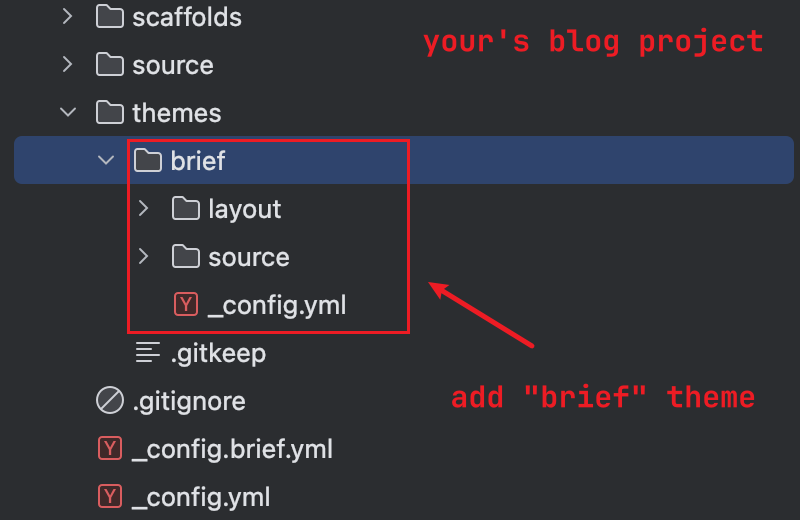

# Hexo-Theme-Brief

A brief theme based on the Hexo **v7.3+**. Inspired by the [hexo-theme-next](https://github.com/iissnan/hexo-theme-next), but completely self-implemented and very lightweight.You can easily customize the content of this theme.

## Install

### by manual

1. download the sourcecode(don't use git clone)
2. cd `/path/to/your/hexo-blog`
3. make "themes/brief" dir
4. copy the "source", "layout" and "_config.yml" dir to your "themes/brief" dir



### by NPM

```bash
cd /path/to/your/hexo-blog
yarn add hexo-theme-brief
# npm install hexo-theme-brief
# pnpm install hexo-theme-brief
```

check that your blog root package.json has the dependency: "hexo-theme-brief"

> PS: The theme is currently in a frenzied iteration, so it's highly recommended to synchronize updates manually

## Usage

1. change the "theme" in your "_config.yml":

```yml
# /path/to/your/hexo-blog-dir/_config.yml
# use "brief"
theme: brief
```
2. Customize the theme configuration

create "_config.brief.yml" in your blog root dir, refer to the configuration instructions below to configure the configuration.

## Configuration

example config: 

```yml
menus:
  home: / || fa fa-home
  about: /about/ || fa fa-user
  tags: /tags/ || fa fa-tags
  archives: /archives/ || fa fa-archive
menus-config:
  enable-icon: true

avatar:
  url: /images/avatar.jpg

site-state: true

social:
  GitHub: https://github.com/w4ngzhen || fa fa-github
  RSS: /atom.xml || fa fa-rss

favicon:
  small: /images/icon_16x16.png
  medium: /images/icon_32x32.png
  apple_touch_icon: /images/icon_32x32.png
  safari_pinned_tab: /images/icon_32x32.png
```

### detail

TO BE DONE😂
